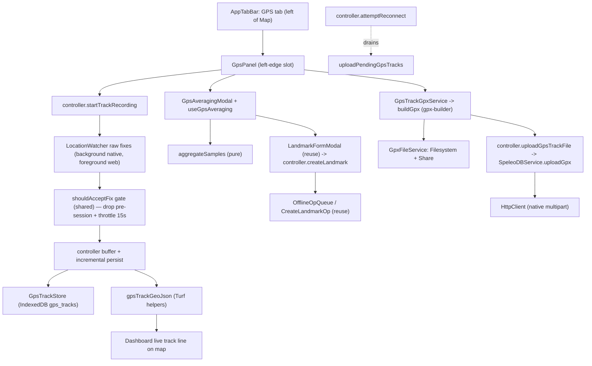

# GPS Tracks, Averaging, Export & Upload

The **GPS** menu (a tab to the left of **Map**) lets a field user record GPS
tracks, collect a high-confidence averaged point and save it as a landmark,
export/share tracks as GPX, and upload them to SpeleoDB. Everything is
offline-first: captured fixes are persisted locally, so
offline use and process death do not silently discard collected points.

This document is the source of truth for the feature's intent, architecture,
API contracts, the averaging/confidence model, the offline model, known
limitations, and the test strategy.

## Feature intent

- **Record a GPS track** -- capture the path you walk as a trail of GPS points
  (a cave-entrance approach, a resurgence, a survey traverse) so the real-world
  surface route can be overlaid on top of the cave survey. To keep tracks light
  it samples ~**one point every 15 s** (`GPS.TRACK_SAMPLE_INTERVAL_MS`); the
  finished track can be exported as GPX or uploaded directly to SpeleoDB. It runs
  on a dedicated full-screen recording screen (`GpsRecordingScreen`, opened from
  the GPS panel via "GPS Track Recording") that shows live ongoing status --
  duration, distance, point count -- with Start / Pause / Resume / Stop controls.
  Duration counts active recording time from Start and **excludes paused wall
  time**, so pausing for ten minutes does not inflate the saved recording timer.
  A **back button** on the
  top-left leaves the screen *without* stopping the recording (recording lives
  in the controller and keeps running in the background -- including with the
  screen locked or the app backgrounded, see *Background recording* below); a separate
  **Cancel**
  button *abandons* the recording -- when recording/paused it confirms first and
  then **discards** the in-progress track, when idle it simply closes the
  screen. The track draws live on the map and captured fixes are persisted
  incrementally. If the process is killed, the partial track is recovered as a
  local saved track on next launch; recording itself is not resumed automatically.
- **High-Accuracy GPS Point** -- collect a single high-confidence point by
  averaging GPS fixes over ~1-2 minutes. The collector opens straight to the
  measurement view in a **held**
  state (placeholder values, GPS watch off). The user presses **Start** to begin,
  **Stop** to halt, **Reset** to clear and re-acquire, watches confidence,
  horizontal/vertical accuracy and a **multi-constellation satellite checklist**
  improve, then saves the point as a landmark (online or offline) with
  name/description.
- **Export / share** a recorded track as a standard GPX 1.1 file.
- **Upload** a track to SpeleoDB (waypoints become Landmarks, tracks become
  GPSTrack rows) when online; queue it when offline and upload on reconnect.

## Where it lives (source map)

| Concern | File |
| --- | --- |
| Types | `src/types/gpsTrack.ts`, `src/types/gnss.ts` |
| GNSS satellite status provider | `src/services/GnssStatusProvider.ts` (default "unsupported"; Android plugin is a follow-up) |
| GPX export/upload builder | `src/utils/gpx.ts` (`gpx-builder` adapter) |
| GPS track GeoJSON construction | `src/utils/gpsTrackGeoJson.ts` (`@turf/helpers` adapter) |
| Averaging math + confidence (pure) | `src/utils/gpsAveraging.ts` |
| Shared GPS fix gate (pre-session drop + throttle, pure) | `src/utils/gpsSampling.ts` |
| Track stats: distance/duration (pure) | `src/utils/gpsTrackStats.ts` |
| Accuracy/unit formatting | `src/utils/measurementUnits.ts` (`formatAccuracyValue`) |
| Share cancellation helper | `src/utils/share.ts` |
| UUID helper | `src/utils/ids.ts` |
| Foreground position watch (averaging/web) | `src/services/GeolocationWatcher.ts` (`LocationWatcher` iface) |
| Background-capable watch (recording, native) | `src/services/BackgroundGeolocationWatcher.ts` (+ `createRecordingLocationWatcher`) |
| Battery-optimization nudge (Android) | `src/services/BatteryOptimizationGuard.ts` |
| Track persistence (IndexedDB) | `src/services/GpsTrackStore.ts` (+ `gps_tracks` store in `src/services/CacheStore.ts`) |
| Shared track -> GPX preparation | `src/services/GpsTrackGpxService.ts` (`gpx-builder` adapter) |
| GPX file write + share | `src/services/GpxFileService.ts` |
| Upload transport | `src/services/SpeleoDBService.ts` (`uploadGpx`) + `src/services/HttpClient.ts` (native multipart) |
| State + business logic | `src/controllers/SpeleoDBController.ts` |
| React bridge | `src/context/useSpeleoDB.ts`, `src/context/SpeleoDBStoreProvider.tsx` |
| Averaging session hook | `src/hooks/useGpsAveraging.ts` |
| UI | `src/components/GpsPanel.tsx`, `src/components/GpsRecordingScreen.tsx`, `src/components/GpsAveragingModal.tsx`, `src/components/GpsScreenHeader.tsx`, `src/components/AppTabBar.tsx` |
| Map wiring + handlers | `src/pages/Dashboard.tsx` |

## Architecture / data flow

State ownership follows `docs/implementation-guidelines.md`: `SpeleoDBController`
owns the recording state machine, the track list, and upload classification;
`GeolocationWatcher`/`GpsTrackStore`/`GpxFileService` perform side effects;
`GpsPanel`/`GpsAveragingModal` are presentational; `useGpsAveraging` isolates
the averaging session's side effects from the modal.

## Shared GPS reading gate (one path, two cadences)

Both GPS features run raw fixes through one shared sampling gate. Recording uses
a `LocationWatcher` (`BackgroundGeolocationWatcher` on native,
`GeolocationWatcher` on web); averaging uses `GeolocationWatcher`. Both use the
same high-accuracy intent, no watcher-level filters, and then run every fix through
the same pure gate, `shouldAcceptFix(timestamp, gate)` in
`src/utils/gpsSampling.ts`, which:

1. **Drops stale watch-start fixes** -- when a watch starts, iOS/Android replay the
   cached last-known location with its *old* timestamp; anything older than the
   active watch start (minus a small timestamp-lag grace) is dropped so the
   timer starts from a real fix rather than an OS replay.
2. **Throttles by time** -- keeps at most one fix per `minIntervalMs`; the first
   in-session fix is always kept immediately, so acquisition feels instant.

The **only** difference between the two features is the cadence:

| Feature | `minIntervalMs` | Why |
| --- | --- | --- |
| High-Accuracy GPS Point (`useGpsAveraging`) | `GPS.AVERAGING_MIN_SAMPLE_INTERVAL_MS` (1 s) | Wants many samples to average down error. |
| GPS Track Recording (`SpeleoDBController`) | `GPS.TRACK_SAMPLE_INTERVAL_MS` (15 s) | A surface walking path doesn't need dense points; keeps tracks small. |

**Why this matters (regression fixed):** recording previously used the watcher's
`minDistanceMeters: 2` filter. The watcher's "last kept" was set to the OS's
replayed last-known location, so while the user stood still every real fix was
within 2 m of that stale point and was silently dropped -- the first recorded
point took ~15-20 s (or never) to appear, while averaging (which never used the
distance filter) was instant. Moving recording onto the shared time gate makes
its first point appear as fast as averaging's.

## GPX contract

`GpsTrackGpxService` is the single shared "track -> GPX file" seam used by both
Share GPX and Upload. It maps a `LocalGpsTrack` into `buildGpx({ tracks,
metadata }, creator)` (`src/utils/gpx.ts`), a thin app adapter over
**`gpx-builder`**. A recorded track becomes one `<trk>` with one or more
`<trkseg>` entries; each fix is mapped to a `<trkpt lat lon>` with optional
`<ele>` (altitude, meters) and `<time>` (ISO-8601). XML construction and
escaping are owned by `gpx-builder`; app code owns policy:
coordinate validation/filtering, metadata mapping, filename selection, and the
creator string. The import path normalizes both named and default exports because
Capacitor production bundles can expose CommonJS-shaped modules differently than
tests. The Vite config also aliases the Node `events` and `url` built-ins to
browser-safe polyfills because `gpx-builder`'s XML dependency graph imports them.

After that shared preparation step, the flows intentionally split:

- `GpxFileService.shareGpx` writes/shares the prepared file.
- `SpeleoDBController.uploadGpsTrackFile` uploads the prepared file through
  `SpeleoDBService.uploadGpx`.

This keeps GPX conversion diagnostics consistent across share and upload while
keeping sharing and uploading modular.

## GeoJSON contract

The app does not store, parse, or render GPX. The canonical live buffer is still
`RecordedPoint[]`; map display uses `src/utils/gpsTrackGeoJson.ts`, which builds
GeoJSON with **`@turf/helpers`**:

- `trackPointsToLineStringFeature` maps valid recorded points to a GeoJSON
  `LineString` using `[longitude, latitude, altitude?]` coordinates.
- `trackPointsToFeatureCollection` feeds the Dashboard live recording source.
- `gpsTracksToFeatureCollection` is available for saved-track map display.

This avoids GPX -> GeoJSON conversion entirely. GPX remains an
interchange/export/upload format generated on demand from `RecordedPoint[]`.

## Upload contract (SpeleoDB)

Uploading a track reuses the backend's GPX import endpoint:

- `PUT /api/v2/import/gpx/`
- `Authorization: Token <token>`
- `multipart/form-data` with field `file` (the `.gpx` document) and optional
  `collection` (a landmark-collection id for any waypoints).
- Success `2xx` body: `{ landmarks_created: number, gps_tracks_created: number }`.
- The backend turns GPX waypoints into Landmarks and GPX tracks into `GPSTrack`
  rows, deduping on identity, so re-importing the same GPX is idempotent
  (returns zeros).

### Native multipart (important)

`HttpClient` only supports `FormData` on web; it is ignored on native. The GPX
upload therefore uses a cross-platform `multipart` payload
(`HttpRequest.multipart`): on web it builds a real `FormData`; on native it
serializes a raw `multipart/form-data` body **string** with an explicit
boundary and matching `Content-Type` for `CapacitorHttp`. GPX is text, so a
string body is byte-correct (no binary encoding needed). The native serializer
quotes multipart names/filenames, rejects CRLF injection in text fields, and
rejects a GPX body containing the generated boundary delimiter. See
`buildMultipartString` in `src/services/HttpClient.ts`.

## Averaging + confidence model

`aggregateSamples(samples, config, now)` (`src/utils/gpsAveraging.ts`):

- **Rejection**: fixes with non-finite/out-of-range coordinates, or horizontal
  accuracy worse than `GPS.AVERAGING_MAX_ACCURACY_METERS`, are dropped (counted
  as `rejectedCount`).
- **Only fixes recorded after Start count, ~1 fix/second.** Intake goes through
  the shared `shouldAcceptFix` gate (see *Shared GPS reading gate* above) with
  `GPS.AVERAGING_MIN_SAMPLE_INTERVAL_MS` (1 s): stale watch-start replayed fixes
  are dropped (with a small timestamp-lag grace for fresh fixes) and sub-second
  bursts are throttled, so the sample count climbs like seconds rather than
  jumping. Correlated sub-second fixes add no real accuracy, so this also keeps
  the average sound.
- **Position**: inverse-variance weighted mean of lat/lng (a fix's weight is
  `1/accuracy²`; fixes without accuracy get unit weight). More accurate fixes
  count more.
- **Altitude**: averaged only over fixes that report it (weighted by
  `1/altitudeAccuracy²`), else `null`.
- **Combined horizontal accuracy**: `sqrt(1 / Σ(1/accuracyᵢ²))`, which improves
  as more fixes accumulate (e.g. four 10 m fixes -> 5 m). `null` if no fix
  reported accuracy.
- **Confidence (0-100)**: `round(100 · base · accuracyScore)` where
  `base = (0.5·timeProgress + 0.5·sampleProgress) ^ CONFIDENCE_EXPONENT` (each
  progress clamped 0-1 against `TARGET_MS`/`TARGET_SAMPLES`) and `accuracyScore`
  is 1.0 at/under `GOOD_ACCURACY_METERS`, a floor at/over `POOR_ACCURACY_METERS`,
  linear between. The exponent (`AVERAGING_CONFIDENCE_EXPONENT`, default `2.2`)
  keeps confidence low early and only lets it climb as both time and samples
  approach their targets, so it does not race to a high value in the first few
  seconds. With fixed accuracy, confidence is still monotonic in time and
  samples and only reaches 100 at both targets.
- **Stable**: `elapsedMs >= MIN_MS && sampleCount >= MIN_SAMPLES` — the
  "good enough to save" hint. Save is allowed at any time, but the UI nudges the
  user to keep collecting until stable.

Constants live in the `GPS` block of `src/constants.ts`
(`AVERAGING_MIN_MS=60s`, `AVERAGING_TARGET_MS=120s`, `AVERAGING_MIN_SAMPLES=30`,
`AVERAGING_TARGET_SAMPLES=60`, accuracy bands, watch options).

Saving an averaged point **reuses** the shared `LandmarkFormModal` +
`controller.createLandmark` seam, so it works online (POST) and offline (queued
`CreateLandmarkOp`) with zero extra wiring. See `docs/landmark-crud.md` and
`docs/offline-landmark-queue.md`.

### Session controls (stopwatch semantics)

The collector behaves like a stopwatch and never runs the GPS watch in the
background. The Dashboard tracks an `averagingPhase` of `idle | running |
stopped`, and `useGpsAveraging` is active only while phase is `running`:

- **Start** (from `idle` or `stopped`) -> `running`: requests permission and
  begins/resumes the high-accuracy watch. Resuming **continues** appending to
  the same sample set (it does not start over).
- **Stop** -> `stopped`: releases the watch but **keeps** the collected samples
  and the last averaged result frozen on screen. Paused wall time is excluded
  from elapsed time/confidence. The primary button becomes **Start** again to
  resume.
- **Reset** -> shows a **confirmation modal** (`ConfirmDialog`,
  `gps-averaging-reset-confirm`). On confirm it bumps `restartNonce`, which
  clears the hook's samples: if `running`, collection continues from zero; if
  `stopped`, it drops back to the zeroed held state. Reset is the **only** action
  that wipes data.
- **Save** stores the current averaged point (enabled whenever a fix exists,
  running or paused). The **back button** on the top-left (see *Shared screen
  layout* below) closes the collector and resets it to `idle`.

### Shared screen layout

Both full-screen GPS tools (`GpsRecordingScreen` and `GpsAveragingModal`) share
the same header via `GpsScreenHeader`: a **back button on the top-left** and a
centered page title (`High-Accuracy GPS Point` / `GPS Track Recording`). The recording
screen additionally renders its ready/recording status tag in the header's
right slot. This keeps the two tools visually consistent and gives every
full-screen GPS view an obvious way out.

The back button's meaning differs by tool: on the collector it closes and
resets the session; on the recorder it leaves *without* stopping (recording
keeps running). The recorder's separate **Cancel** button is the destructive
"abandon" path -- it confirms (`ConfirmDialog`, `gps-recording-cancel-confirm`)
and calls `controller.discardTrackRecording()` to stop the watch and delete the
in-progress track when recording/paused, or just closes the screen when idle.
`discardTrackRecording()` mirrors `stopTrackRecording()` minus the persist step:
it stops the watch, removes the in-progress record from `GpsTrackStore`, and
resets state to `idle` without adding a saved track.

Mechanically: pausing toggles the hook's `active` to false. The watch effect's
cleanup stops the watch/GNSS provider but **does not** clear `samples` (so the
result stays frozen). Clearing happens only via the render-phase reset guarded by
`restartNonce` (React's "adjust state when a prop changes" pattern), which fires
regardless of whether the session is running or paused.

## Multi-constellation & multi-band (GNSS) status

Modern phone receivers automatically track every GNSS constellation (GPS,
GLONASS, Galileo, BeiDou, QZSS, SBAS) and, on capable hardware, multiple
frequency bands (L1 + L5/E5/B2a) and fuse whatever they can. **The app cannot
choose or force the mix** — it only requests high accuracy
(`enableHighAccuracy: true`), which lets the OS use all of it. "The more mixed
the better" is therefore a device/OS capability, already maximized.

The averaging modal shows a **satellite checklist** with a green check / red
cross per constellation, driven by an injectable `GnssStatusProvider`
(`src/services/GnssStatusProvider.ts`) surfaced through `useGpsAveraging` as a
`GnssStatusSnapshot`:

- `inUse === true` -> green check; `false` -> red cross; `null` / unsupported ->
  a neutral dash.
- A **Multi-band / Single band** badge appears when the platform reports it.

**Platform reality (important):** live per-constellation / multi-band status is
exposable **only on Android** (the native `GnssStatus` / `GnssMeasurement`
APIs). **iOS (CoreLocation) and the web expose nothing** — they hand apps a
high-level position with no satellite detail, and `@capacitor/geolocation`
surfaces none of it on any platform. So the **default provider reports
`supported: false`**.

To avoid a confusing all-dashes list, the UI adapts to `gnss.supported`:

- **Supported (Android, with a native provider wired):** the per-constellation
  checklist renders with green check (in use) / red cross (visible-but-unused)
  and the multi-band badge.
- **Unsupported (iOS / web):** the per-constellation rows are **hidden** (they
  would be meaningless dashes). Instead a single honest **GNSS fix indicator**
  is shown — "Acquiring GNSS fix…" while running without a fix, "GNSS fix
  acquired" (green check) once readings arrive, "Not started" when held — plus a
  note that the device auto-combines every constellation/band it can receive and
  a per-satellite breakdown isn't available on the platform. No data is faked.

A native Android `GnssStatus` plugin can be dependency-injected later (via
`useGpsAveraging`'s `gnssProvider` option) to light up the real green/red
checklist; iOS can never support it. This is a tracked follow-up.

## Offline-first model

GPS work mirrors the landmark offline model (`docs/networking.md`,
`docs/offline-mode.md`), request-driven, with no passive connectivity listeners.

- **Recording** is fully local and always available; it writes nothing to the
  network. The in-progress track is persisted to IndexedDB **incrementally**
  (on each kept fix), with per-track writes serialized so a slower earlier write
  cannot overwrite a newer longer point buffer. A force-quit mid-recording
  recovers the captured points on next launch as a local partial track. The watch is not automatically
  restarted after process death. Nothing is written
  **until the first fix arrives** -- persisting an empty record up front would,
  on a force-quit during GPS warm-up, leave a useless 0-point "track" that can't
  be uploaded; `GpsTrackStore.list()` additionally drops (and self-heals) any
  0-point record left by older builds.
- **Track upload** is classified exactly like a landmark mutation:
  - `2xx` -> `uploaded` (stores the server's created counts).
  - offline-locked, transport error / timeout / `5xx`, `408`, or `429` ->
    `pending`; the app flips to offline mode (`enterOfflineMode`) for runtime
    reachability failures except rate limiting. The track is **never** dropped.
  - definitive `4xx` or local GPX/multipart serialization failure -> `error`
    with the message, kept for inspection and retry.
- **Draining**: `uploadPendingGpsTracks()` re-uploads every `pending` track and
  is wired into both successful startup validation and
  `controller.attemptReconnect()` (the Settings **Go Online** / Pending **Try
  Reconnect** path). Only tracks whose upload was attempted and marked
  `pending` auto-drain; untouched `local` tracks require the user to tap Upload.
  It is a no-op while offline-locked or unauthenticated and stops mid-run if the
  app drops offline again.
- **Averaged landmark save** uses the existing offline landmark queue, so saving
  offline queues a `CreateLandmarkOp` and folds optimistically over the map.
- All recorded tracks are cleared on logout via `ProjectCacheService.clearAll()`
  (the `gps_tracks` store), alongside projects, geojson, and the offline queue.

## Persistence

Tracks live in a dedicated `gps_tracks` IndexedDB object store, added in
`CacheStore` **v3** via an additive `createObjectStore` migration
(`projects`/`geojson`/`offline_ops` data is preserved with zero loss). Each
track is one record keyed by id, so a force-quit can only ever affect the single
track being written. `GpsTrackStore` is a dumb persistence layer (no network, no
business decisions).

## Background recording (screen off / app backgrounded)

Track recording keeps running with the screen locked or the app backgrounded.
This needs a background-capable native location source, which the stock
`@capacitor/geolocation` plugin does not provide, so recording uses
**`@capacitor-community/background-geolocation`** via
`BackgroundGeolocationWatcher` (a `LocationWatcher`). The stationary
High-Accuracy point collector is a short foreground task and stays on
`GeolocationWatcher`. `createRecordingLocationWatcher()` picks the
background watcher on native devices and the plain foreground watcher on web
(the plugin is native-only). Both still feed the shared `shouldAcceptFix` gate,
so the *sampling logic* is identical -- only the native source differs, because
background capability is a hard platform requirement.

What makes it work (all wired in this repo):

- **iOS:** `UIBackgroundModes: [location]` in `Info.plist`, an "Always" purpose
  string (`NSLocationAlwaysAndWhenInUseUsageDescription`), and the plugin's
  `allowsBackgroundLocationUpdates`. The status bar turns blue while tracking.
- **Android:** the plugin runs a **foreground service** with a persistent
  notification (text from `GPS.BACKGROUND_TRACKING_TITLE/MESSAGE`, channel name
  in `strings.xml`); it contributes foreground-service/location permissions via
  manifest merge, and the app declares `POST_NOTIFICATIONS` (Android 13+) and
  requests it **best-effort** before recording starts via a small **local,
  Android-only** Capacitor plugin (`RecordingNotificationPermission`) so nothing
  notification-related is linked into the iOS build. Recording does **not**
  depend on the grant -- the foreground service runs even if the user declines
  (the notification is simply hidden), so a denial never blocks recording.
  `capacitor.config.ts` sets `android.useLegacyBridge: true` so updates don't
  halt ~5 min after backgrounding.

Defining `backgroundMessage` on `addWatcher` is what enables background delivery;
`removeWatcher` (on Stop/Cancel/pause/logout) tears down the service. The watcher
uses the same `generation` race-guard as `GeolocationWatcher` so a stop landing
mid-`addWatcher` can't leak a background subscription.

### Battery-optimization nudge (Android reliability)

Aggressive OEM power managers (Samsung, Xiaomi, Huawei, …) can kill the
foreground service under Doze and cut a long recording short. When recording
starts on Android and the app is still battery-optimized, the recording screen
shows a one-time, dismissible banner (`gps-battery-optimization-hint`) offering
to open the system "ignore battery optimization" dialog
(`@capawesome-team/capacitor-android-battery-optimization`, MIT, via
`BatteryOptimizationGuard`). It is a pure *reliability nudge*: recording works
whether or not the user grants it, the helper is a no-op off Android, and
dismissal is per-session. Needs the `REQUEST_IGNORE_BATTERY_OPTIMIZATIONS`
permission. iOS has no equivalent (the OS keeps the location background mode
alive on its own).

> Play policy note: the direct "ignore battery optimization" dialog
> (`requestIgnoreBatteryOptimization`) is restricted by Google to apps with an
> acceptable use case. Continuous, user-initiated GPS track recording backed by a
> foreground-location service qualifies, but if review pushes back, switch to
> `openBatteryOptimizationSettings()` (opens settings without the direct grant).

## Permissions

Recording and averaging require the OS location permission, requested on demand
via the watcher's `requestPermissions()`; a location denial throws before
recording starts and surfaces a clear message (a toast for recording, an inline
message in the averaging modal) and never crashes. Background recording
additionally requests the platform background capability where available (iOS
Always via the background plugin) and, on Android 13+, the `POST_NOTIFICATIONS`
permission before starting or resuming the foreground-service recorder. The
notification permission is requested **best-effort only** -- it is never
required: if the user declines it, recording still starts (the foreground
service runs without a visible notification). Purpose strings are documented in
`docs/app-permissions.md`.

**Recording watch errors are classified, not swallowed.** A *fatal*
authorization error during a live recording -- the background plugin's
`code: 'NOT_AUTHORIZED'` (permission revoked / "Always" denied / location
services turned off) or the web `GeolocationPositionError.code === 1`
(`PERMISSION_DENIED`) -- stops the recording, resets state to `idle`, and shows
a toast (`gpsRecordingError` on the controller, surfaced once by the Dashboard
and then cleared). Any points already captured are **finalized into a saved
track** so no fixes are lost. A *transient* error (e.g. a brief "signal lost")
is logged and recording keeps running. Without this, a "When in use"-only grant
left the recorder sitting at "Recording - 0 pts" forever with no feedback.

## Known limitations (by design, tracked)

- **Live per-constellation satellite status is Android-only.** iOS/web cannot
  report it; the checklist shows "unavailable" there. Wiring the native Android
  `GnssStatus` provider is a tracked follow-up.
- **Upload is whole-file**, mirroring the web viewer's GPX import; there is no
  partial/append upload.

## Performance

- The averaging aggregator and GPX builder are pure and O(n) in samples/points.
- The live recording track is a single MapLibre GeoJSON line source updated from
  the in-memory buffer; incremental IndexedDB writes are one small record per
  kept fix, and recording keeps only ~1 fix / 15 s, so writes are infrequent.
- Multi-thousand-point tracks serialize and render without special-casing; GPX
  text is built once per export/upload.

## Tests

- Pure/services: `src/utils/gpx.test.ts`, `src/utils/gpsTrackGeoJson.test.ts`,
  `src/services/GpsTrackGpxService.test.ts`, `src/utils/gpsAveraging.test.ts`,
  `src/utils/gpsSampling.test.ts` (shared fix gate: pre-session drop + both
  cadences), `src/utils/gpsTrackStats.test.ts`,
  `src/utils/measurementUnits.test.ts`, `src/utils/share.test.ts`.
- Services: `src/services/HttpClient.test.ts` (native multipart + web FormData),
  `src/services/SpeleoDBService.test.ts` (`uploadGpx`),
  `src/services/GpsTrackStore.test.ts` (CRUD + additive migration + logout
  purge), `src/services/GeolocationWatcher.test.ts` (filters, permission, watch
  errors), `src/services/GpxFileService.test.ts` (web fallback, native share,
  cancellation, write failure), `src/services/GnssStatusProvider.test.ts`.
- Hook: `src/hooks/useGpsAveraging.test.ts` (incl. Reset/restartNonce + GNSS
  provider subscribe/stop).
- Controller (incl. chaos): `src/controllers/SpeleoDBController.test.ts` —
  recording lifecycle, default track naming, **instant first fix + 15 s throttle**,
  permission denial, empty recording discard, cancel/discard, pause/resume,
  serialized incremental persistence,
  **force-quit mid-recording recovery**, rename/delete, upload classification
  (2xx/4xx/5xx/transport/offline/unauthenticated), reconnect drain, watch-error
  resilience, and logout teardown.
- UI: `src/components/AppTabBar.test.tsx` (GPS tab placement + recording dot),
  `src/components/GpsPanel.test.tsx`, `src/components/GpsAveragingModal.test.tsx`
  (both include a solid button-variant guard), and `src/pages/Dashboard.test.tsx`
  GPS wiring.

## Change checklist (GPS)

1. Keep the controller the source of truth for recording/upload state.
2. Preserve the offline-first guarantees (no silent data loss; pending drains on
   reconnect only; no passive listeners).
3. Every `.app-btn` must carry a solid `app-btn--*` variant (see
   `docs/coding-rules.md`).
4. Update this document when behavior changes; run the targeted tests above plus
   `npm run build`.
