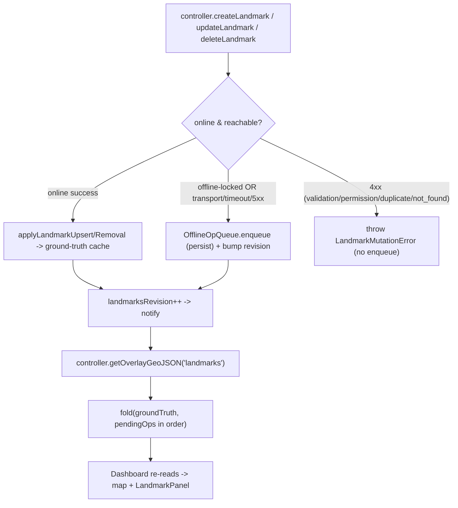

# Offline Landmark Queue

Offline create / edit / delete for landmarks. Mutations made while offline (or
while a request fails in a way that means "not reachable") are queued, reflected
optimistically on the map, and replayed -- correctly, idempotently, and
observably -- when connectivity returns. This extends the online feature in
`docs/landmark-crud.md`; it does not replace it.

## Feature intent

- A landmark create/edit/delete must never be silently dropped because the
  device was offline or the network blipped. The user's intent is captured,
  shown, and survives app shutdown, crash, and phone restart.
- The map and Landmark panel update immediately (optimistically) so offline work
  feels identical to online work.
- When connectivity returns, queued work replays against the authoritative
  server state. Where the server diverged, the user resolves the conflict with a
  clear, non-technical diff -- never an automatic "silently pick a winner".

## The core decision: ground truth + fold

There are two layers:

- **Ground truth**: the cached `overlay:landmarks` `FeatureCollection`
  (`ProjectCacheService`). It is written **only** by a confirmed server response
  -- a successful online mutation or a project sync. It is never mutated while
  offline.
- **Pending ops**: an ordered, persistent queue of `OfflineOp`s.

What the user sees is `fold(groundTruth, pendingOps)`, recomputed on demand in
`SpeleoDBController.getOverlayGeoJSON('landmarks')`. Because the Dashboard
already re-reads that method whenever `landmarksRevision` bumps, enqueuing or
discarding an op (which bumps the revision) re-renders the optimistic state with
zero Dashboard changes.

Why fold instead of mutating the cache and storing an "undo"? Discarding a
pending op (or reordering the queue) becomes a pure recompute -- no re-pull,
which matters because we may be offline. The ground truth is always a clean
server snapshot we can reconcile against.

While pending ops exist (or replay is actively writing confirmed results),
`syncProjects()` skips the landmarks overlay full-refresh. Other overlays still
sync normally. This prevents a background `/landmarks/geojson/` snapshot from
overwriting the ground-truth cache underneath local pending work; once the queue
drains, a normal project sync can refresh landmarks again.

## When does an op get enqueued?

`createLandmark` / `updateLandmark` / `deleteLandmark` classify the outcome:

- **offline-locked** (`hasNetworkAccess()` is false) -> enqueue immediately.
- **online, transport error / timeout / 5xx** -> "not reachable"; the controller
  calls `enterOfflineMode()` (so the app immediately flips to offline, shows the
  offline modal, and reveals Go Online) and enqueues. This matches the
  request-driven offline model in `docs/networking.md` (a 5xx/timeout is a
  server-unreachable signal, not a definitive answer). The user then reconnects
  via Go Online before replaying the queue.
- **online, 4xx** (validation / duplicate / permission / not_found) -> a
  definitive answer; the typed `LandmarkMutationError` is thrown and the form
  shows it. Nothing is enqueued.
- **online success** -> unchanged: the existing single cache-write seam upserts
  the confirmed landmark into ground truth.

## The op model

`OfflineOp` (abstract, `src/offline/ops/OfflineOp.ts`) is entity-agnostic so
future objects can subclass it. It owns only pure capabilities:

- `applyTo(fc)` -- fold this op over a `FeatureCollection`.
- `describe()` -- a human summary for the pending list.
- `serialize()` -- the persistable shape.
- `subjectId()` -- the landmark id this op concerns.

Concrete subclasses:

- `CreateLandmarkOp` -- holds a fully-formed optimistic `LandmarkApiObject` with
  a `local:<uuid>` temp id (so it renders immediately). Display props
  (collection name/color) are resolved from the cached writable-collections list
  at enqueue time.
- `UpdateLandmarkOp` -- `targetId`, `baseline` (last known server state), `next`
  (intended values).
- `DeleteLandmarkOp` -- `targetId`, `baseline`.

Network replay + conflict detection live in `OfflineOpQueue`, not on the ops, so
ops stay free of HTTP and are trivially unit-testable.

### The footprint ("last known state") — how it is built

A **footprint** is the small set of server-owned, comparable fields of a
landmark, derived from a `LandmarkSnapshot`. It is the unit of change detection.
Construction (`src/offline/landmarkSnapshot.ts`):

1. Take the landmark feature/object and extract:
   - `name` (string, raw)
   - `description` (string, raw; missing -> `''`)
   - `latitude` and `longitude`, each **rounded to 6 decimal places**
     (`FOOTPRINT_COORDINATE_PRECISION`).
2. Reduce to a stable canonical string (`canonicalizeSnapshot`): a JSON array in
   a fixed field order with the coordinates re-rounded. Two footprints are equal
   iff their canonical strings are byte-identical (`snapshotsEqual`).

The `LandmarkSnapshot` object still carries `collection` (used for the PATCH
payload and the optimistic display), but it is **not** part of the footprint —
see below.

**Why coordinates are rounded to 6 dp.** The two server surfaces disagree on
precision: the create/edit API (`POST/PATCH /api/v2/landmarks/`) returns **7
decimals** while the map `/api/v2/landmarks/geojson/` endpoint serializes **6**.
The ground-truth cache can hold either shape (geojson shape after a sync; the
create/edit shape after `applyLandmarkUpsert(buildLandmarkFeatureFromApi)`).
Comparing 7 dp against 6 dp flagged a false conflict on every edit/delete.
6 decimal degrees (~0.11 m) is finer than any meaningful landmark move, so
rounding both surfaces to 6 dp makes them agree without losing real-change
sensitivity.

**Why `collection` is excluded.** The personal collection is represented
irreconcilably across surfaces: the create/edit API returns the personal
collection's **UUID**; the geojson endpoint **empties** it (this is exactly why
the Landmark panel falls back to a synthetic personal id when
`properties.collection` is empty). Neither the `is_personal_collection` flag nor
the writable-collections list is reliably populated on the cached create/edit
representation, so there is **no dependable client-side way to map one form to
the other**. Including `collection` therefore flagged a false conflict on every
edit/delete of a personal landmark. It is excluded from the footprint (and from
the diff/conflict views). This is an explicit product limitation, not perfect
conflict detection: a collection-only server move is treated as
last-writer-wins, consistent with the online eventual-consistency model in
`docs/landmark-crud.md`. Changes to name/description/position are still
detected. Create-replay identity matching (for the "already exists" dedupe) uses
**name + 6 dp coordinates** for the same reason.

**Where the two footprints come from (the comparison the user asked for).**

- **Baseline footprint** = built from the cached **ground-truth** feature — the
  last representation the server gave us — at the moment the edit/delete is
  queued. It is captured **only** from the ground truth, never fabricated from
  the user's own edit. If the landmark is not in the ground truth, the baseline
  is recorded as `null` ("unknown footprint") and the op is pushed without a
  conflict (no reliable upstream to compare against).
- **Fresh footprint** = built from the freshly pulled `/landmarks/geojson/`
  feature at sync time.

If baseline == fresh, the server is unchanged -> push. If they differ (and the
baseline is non-null) -> conflict. One exception comes first for updates: if the
fresh server footprint already equals the op's intended `next` state, the op is
treated as already satisfied (see the idempotency note under Persistence).

## Persistence

Ops live in a dedicated `offline_ops` IndexedDB object store (added in
`CacheStore` v2 via an additive `createObjectStore` migration -- existing
`projects`/`geojson` data is preserved). `OfflineOpStore` stores **one record
per op** (keyed by op id), so a force-quit mid-sync can only affect the single
op being mutated. Ground truth is written only after the server confirms, and an
op is removed only after ground truth is written, so any interruption replays
cleanly. Persistence failures fail closed: the controller does not report an
offline mutation as accepted unless the op was durably written, and status
changes (`conflict` / `error`) are persisted before the sync summary is returned.
The store is cleared on logout via `ProjectCacheService.clearAll()`.

**Update idempotency under force-quit.** An update writes ground truth then
removes the op. If the process dies *between* those two steps, the op survives
with its **pre-edit** baseline while the server already holds the **post-edit**
state — naively a baseline mismatch that looks like a conflict. To replay
cleanly, `replayUpdate` first checks whether the fresh server footprint already
equals the op's `next`; if so the op is satisfied (adopt the server feature into
ground truth, remove the op) without a redundant PATCH or a spurious, empty-diff
conflict. The same short-circuit absorbs a two-device case where another client
already made the identical edit. Create and delete are idempotent by other means
(create dedupe by identity on "already exists"; a delete of an already-missing
landmark is treated as success).

## Coalescing: one landmark, one pending op

Enqueue coalesces so the queue never builds intra-queue dependency chains and
the pending list stays readable:

- Editing a not-yet-synced offline create -> mutate the create in place.
- Deleting a not-yet-synced offline create -> drop the create entirely (it never
  existed server-side, leaves no trace).
- A second edit of the same landmark -> replaces the earlier edit's `next`
  (keeps the original server baseline).
- A delete of a landmark with a pending edit -> the delete supersedes the edit
  (and inherits the edit's original baseline).
- An edit of a landmark with a pending delete -> the edit supersedes the delete
  (the user intent changed from "remove it" to "keep it with these values").

A consequence: an `UpdateLandmarkOp`/`DeleteLandmarkOp` only ever targets a real
server id, so cross-op id remapping is largely unnecessary. The queue still
performs a defensive remap when a create lands (rewrites any op still pointing at
the temp id to the real id).

## Replay + conflict semantics

`syncAll()` / `syncOne(id)` run in chronological order. The server landmarks
GeoJSON is pulled once per run; each op is compared against it:

- **create** -> POST.
  - `2xx` -> capture the real id, defensively remap dependents, upsert into
    ground truth, remove the op. If the server returns `2xx` without a landmark
    body, re-pull landmarks and match by identity before finalizing; never write
    a `local:` temp id into ground truth.
  - `400 "already exists"` -> the landmark is already on the server (e.g. a flaky
    "200 to nothing" tunnel that actually committed). Match it by identity
    (**name + 6 dp coordinates**), adopt the server id, remove the op. This
    is the duplicate-prevention guarantee.
  - other `4xx` -> mark `error` (kept in the queue, surfaced to the user).
  - `5xx` / transport -> connectivity lost mid-run; abort the rest (left
    pending).
- **update** -> first, if the server already equals the op's `next`, the op is
  already satisfied: adopt the server feature into ground truth, remove the op
  (idempotent force-quit / two-device replay; no redundant PATCH). Otherwise, if
  `baseline` is `null`, push directly (no footprint to compare). Otherwise compare
  the server's current snapshot to `baseline`:
  - equal -> PATCH -> upsert + remove (re-PATCH of identical values is a 200, so
    a replayed op is idempotent).
  - different (or server no longer has it) -> mark `conflict`.
- **delete** -> if the server already removed it, the delete is satisfied
  (remove from ground truth + queue; a re-DELETE of a missing landmark is a 404,
  treated as success). Else if `baseline` is `null`, DELETE directly. Otherwise
  compare server snapshot to `baseline`:
  - equal -> DELETE -> remove.
  - different -> mark `conflict`.

A conflict (or error) for a landmark blocks later ops for the **same** subject in
that run but does not stop the rest of the queue from draining (partial failure
is fine). Conflicts are derived **live**: on load, transient statuses
(`syncing`/`conflict`) reset to `pending`, so a reopened app re-derives conflict
state fresh against the current server rather than restoring a stale snapshot.

### Conflict resolution

`resolveOfflineOpConflict(id, 'local' | 'server')`:

- **local** ("Keep my change") -> force the request (PATCH/DELETE) regardless of
  server drift, then upsert/remove ground truth and drop the op. If the force
  request gets a definitive 4xx, the op remains queued as `error` and the user is
  not told the change was kept.
- **server** ("Use server version") -> discard the op and write the current
  server state into ground truth (upsert the server feature, or remove it if the
  server deleted it).

## UX

- A **Pending** tab appears in the bottom tab bar between **Map** and
  **Settings**, only when there are queued ops, with a count badge. Route
  `/pending` (registered in `App.tsx` + `AuthenticatedAppShell.tsx`).
- The **Pending Changes** page lists ops newest-first with a kind badge, title,
  summary, and timestamp. **Sync Now** drains the queue; each row has **Sync**
  and **Delete** (discard reverts the map via re-fold). Sync actions are disabled
  while offline-locked, including conflict resolution. While offline, the page
  also shows **Try Reconnect**, wired to the same `controller.attemptReconnect()`
  flow as Settings **Go Online**.
- `OfflineOpConflictModal` shows a plain-language, two-column "Your change" vs
  "On the server" diff (only fields that differ) with two large choices. Built
  for non-technical users -- no ids, no jargon.

## Reuse: averaged GPS points

The GPS menu's "collect an averaged point and save it as a landmark" flow reuses
this queue verbatim: it hands the averaged coordinates to the shared
`LandmarkFormModal` and `controller.createLandmark`, so saving offline enqueues a
`CreateLandmarkOp` and folds optimistically exactly like any other offline
create. No GPS-specific queue logic exists. See `docs/gps-tracks.md`.

Recorded GPS track uploads are separate from this landmark mutation queue. A
track becomes `pending` only after the user attempts Upload and the request is
offline/retryable; those pending uploads drain after successful startup
validation or the explicit Go Online/Try Reconnect path. Untouched local tracks
stay local until the user uploads them.

## Key APIs / source map

- Types: `src/types/offlineOp.ts`.
- Snapshot/diff helpers: `src/offline/landmarkSnapshot.ts`.
- Ops: `src/offline/ops/{OfflineOp,CreateLandmarkOp,UpdateLandmarkOp,DeleteLandmarkOp,deserialize}.ts`.
- Persistence: `src/offline/OfflineOpStore.ts` (+ `offline_ops` in `src/services/CacheStore.ts`).
- Orchestration: `src/offline/OfflineOpQueue.ts`.
- Controller seam: `SpeleoDBController` (`createLandmark`/`updateLandmark`/
  `deleteLandmark`, `getOverlayGeoJSON`, `getPendingOps`, `syncOfflineOps`,
  `syncOfflineOp`, `discardOfflineOp`, `resolveOfflineOpConflict`,
  `pendingOpsCount`, `pendingOpsRevision`).
- Context: `pendingOpsCount` / `pendingOpsRevision` via `useSpeleoDB`.
- UI: `src/pages/PendingOps.tsx`, `src/components/OfflineOpConflictModal.tsx`,
  `src/components/AppTabBar.tsx`.

## Tests

- Pure units: `src/offline/landmarkSnapshot.test.ts`, op classes, and
  `src/offline/OfflineOpQueue.test.ts` (fold, coalescing, replay, conflict,
  resolve, id remap).
- Persistence + migration: `src/offline/OfflineOpStore.test.ts`.
- Chaos: airplane-mode enqueue, force-quit after a PATCH committed (pre-edit
  baseline, server at the intended `next`) draining idempotently without a false
  conflict, a genuine server divergence still conflicting without overwrite,
  "200 to nothing" duplicate prevention, two-device conflict (both resolutions),
  partial failure, mid-run connectivity loss, chained create+edit+delete.
- Controller: `src/controllers/SpeleoDBController.test.ts` (offline enqueue,
  online network-failure enqueue, online 4xx no-enqueue, folded overlay read).
- Components: `src/pages/PendingOps.test.tsx`,
  `src/components/OfflineOpConflictModal.test.tsx`,
  `src/components/AppTabBar.test.tsx` (tab hidden/shown + badge), plus a
  Dashboard optimistic-marker case.
